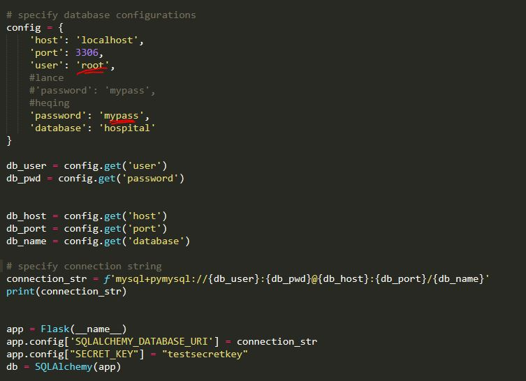

# Getting the Hospital App Up & Running:

1. The database is backed up as a MariaDB .sql file called <em>back.sql</em> in the *Data* folder.
2. Since we all run Python locally, we linked to the MariaDB locally using SQLAlchemy. Username and password information may need to be changed from 'root' and 'mypass' in *index.py* 
3. Our web application is in the main folder as *index.py* We did not have the DockerFile automatically run the python script, so it'll need to run through the command line. 
